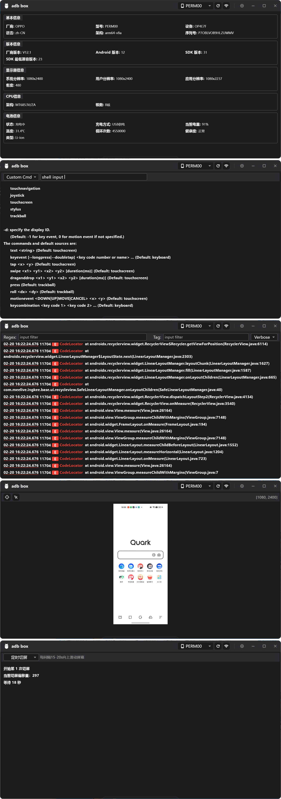

## adb_box 

通过封装ADB实现可视化控制手机，抽取常用控制指令，方便不同业务场景定制开发， 具体可参考 [定时切屏-刷看视频金币](https://github.com/YangLang116/adb_box/blob/main/lib/route/hall/tab/script/script/script_switch_screen.dart)

## screenshot

